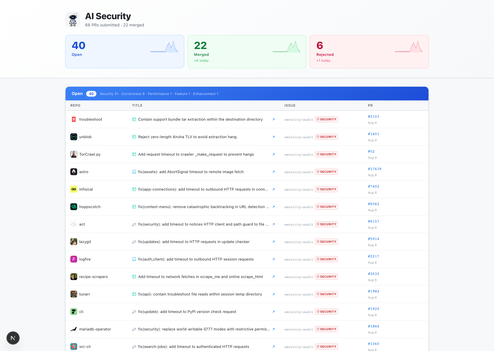
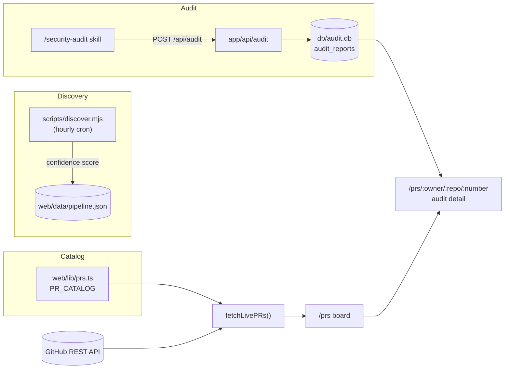
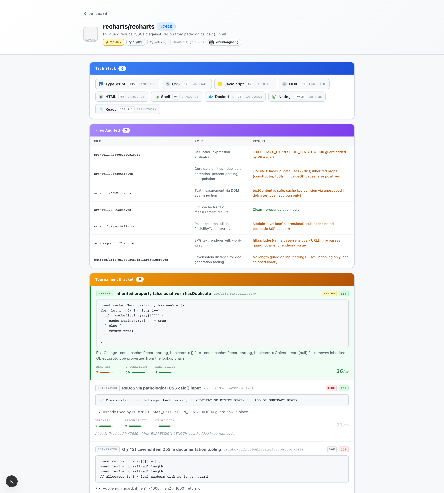

# ai-security

Turns real, merged security fixes to popular open-source projects into a public, provable engineering record - discovered, audited, and tracked automatically.



[](LICENSE)


## Contents

- [Why this exists](#why-this-exists)
- [Features](#features)
- [Architecture](#architecture)
- [Tech stack](#tech-stack)
- [Quick start](#quick-start)
- [Configuration](#configuration)
- [Project layout](#project-layout)
- [License](#license)

## Why this exists

Anyone can claim they "contribute to open source." A merged PR fixing a real vulnerability in a 27,000-star repo is proof a stranger can verify in thirty seconds - no resume bullet gets that kind of credibility for free.

- **Third-party-verified proof of skill.** Every row on the board links to a real, live GitHub PR. Nobody has to take your word for it.
- **A defensible audit trail, not a vibes-based fix.** Each PR is backed by a stored record of every file checked, every competing finding considered, and why the winning one beat the runner-up - see the [audit trail](#features) below.
- **Interview-ready by construction.** Because the reasoning behind each fix is captured at audit time, you can walk an interviewer through the finding, the fix, and the trade-offs months later without re-deriving it from a diff.
- **Signal over spam.** A one-PR-per-repo rule plus confidence scoring means maintainers see one well-reasoned fix, not a drive-by flood - the thing that gets PRs merged instead of closed.
- **The tedious part is automated.** An hourly scan does the searching across dozens of repos so the only manual work left is auditing a shortlisted candidate and reviewing the generated PR.

## Features

- **Hourly discovery scan** - `scripts/discover.mjs` scans a curated seed list plus live GitHub search, scores each candidate issue by repo vitality, issue age, maintainer engagement, and a security bonus, and filters out anything below a confidence threshold
- **Full audit trail per PR** - each submission stores which files were audited and why, a tournament of every candidate finding considered (ranked by realness, patchability, and mergability, with eliminated candidates and their reasons kept), the winning fix, and generated interview talking points
- **Live PR board** - every submitted PR grouped by real-time status (Open / Merged / Draft / Rejected), pulled straight from the GitHub API and cached for 5 minutes
- **Category and repo-type tagging** - PRs are tagged security / correctness / performance / feature / enhancement, and repos are tagged by kind (library, tool, AI, app, API, game) for fast scanning of the board
- **Tech-stack detection per repo** - languages and key frameworks shown per audited repo, sourced from the GitHub API

## Architecture

Two independent producers feed one SQLite-backed catalog, which a Next.js app reads and merges with live GitHub state at request time.



| Layer | Role |
|-------|------|
| `scripts/discover.mjs` | Finds and scores candidate repos/issues, independent of the web app |
| `/security-audit` skill | Performs the actual audit on a chosen repo and posts the report |
| `db/audit.db` (better-sqlite3) | Stores one audit report per `(repo, pr_number)`: files audited, findings tournament, PR body, talking points, tech stack |
| `web/lib/prs.ts` | Hand-curated catalog of submitted PRs, merged with live GitHub status |
| `/prs` | The public board, grouped by status |
| `/prs/[owner]/[repo]/[number]` | Per-PR detail page rendering the stored audit report |

## Tech stack

| Layer | Tech |
|-------|------|
| Framework | Next.js 16 App Router (server components) |
| Language | TypeScript 5 (strict) |
| Styling | Tailwind CSS |
| Data | better-sqlite3 (audit reports), GitHub REST API v3 (live PR/issue state) |
| Discovery | Node.js + `gh` CLI |
| Tests | Vitest |

## Quick start

```bash
# 1. Clone
git clone https://github.com/bunlongheng/ai-security.git
cd ai-security/web

# 2. Install dependencies
npm install

# 3. (Optional) add a GitHub token to raise the API rate limit from 60 to 5,000 req/hr
echo "GITHUB_TOKEN=ghp_..." >> .env.local

# 4. Run the dev server
npm run dev        # http://localhost:3018
```

Visiting `/` redirects to `/prs`, the live board.

### Running the discovery scan

```bash
# From the repo root
node scripts/discover.mjs
```

Scans every repo in `SEED_REPOS` plus live GitHub search results, and keeps a candidate only if:
1. The repo has real vitality: at least 1 merged PR in the last 60 days
2. It has an open bug issue with no competing pull request
3. Its confidence score is 30 or higher

Confidence is a 0-100 score:

| Signal | Points |
|--------|--------|
| No competing PR exists | +40 |
| Repo vitality >= 8 merged PRs/60 days | +25 |
| Repo vitality >= 5 merged PRs/60 days | +18 |
| Repo vitality >= 3 merged PRs/60 days | +12 |
| Repo vitality >= 1 merged PR/60 days | +5 |
| Issue age 30-180 days | +20 |
| Issue age 181-365 days | +10 |
| Issue has a maintainer comment | +15 |
| Flagged as security-relevant | +20 |

Results are written to `web/data/pipeline.json` (gitignored - runtime data). Schedule it hourly with cron or any task scheduler:

```cron
13 * * * * cd /path/to/ai-security && node scripts/discover.mjs >> /tmp/discover.log 2>&1
```

### Auditing a candidate and recording the trail

Run the `/security-audit <owner/repo>` skill against a shortlisted candidate. It performs the audit and posts the result to `POST /api/audit`, which stores it in `db/audit.db` keyed by `(repo, pr_number)`. The detail page at `/prs/:owner/:repo/:number` renders it automatically once a matching PR is in the catalog.



### Adding a submitted PR

Edit `web/lib/prs.ts` and append to `PR_CATALOG`:

```ts
{
  number: 10465,       // actual PR number on GitHub
  repo: "owner/repo",  // e.g. "marimo-team/marimo"
  title: "fix: short description",
  issue: "#9624",
  submittedAt: "2026-08-05",
}
```

The board picks up live status on the next page load (cached for 5 minutes).

## Configuration

| Env var | Default | Purpose |
|---------|---------|---------|
| `GITHUB_TOKEN` | none (60 req/hr, unauthenticated) | Raises the GitHub API rate limit to 5,000 req/hr; needs `read:repo` scope |

## Project layout

```
ai-security/
- scripts/
  - discover.mjs          # hourly discovery engine (confidence scoring, seed repos)
- db/
  - migrations/           # SQLite schema for audit_reports
- web/
  - app/
    - prs/
      - page.tsx                          # the live PR board
      - [owner]/[repo]/[number]/page.tsx  # per-PR audit detail page
    - api/
      - audit/         # POST: store an audit report
      - opportunity/   # PATCH: favorite / skip a discovered candidate
      - scan/          # POST: trigger a discovery scan on-demand
  - lib/
    - prs.ts            # PR_CATALOG + live GitHub status merge
    - db.ts             # audit_reports read/write (better-sqlite3)
  - data/               # gitignored runtime data (pipeline.json written by discover.mjs)
```

## License

[MIT](LICENSE) (c) Bunlong Heng

---

<p align="center">
  <sub>Built by <a href="https://bunlongheng.com">Bunlong Heng</a> &middot; <a href="https://bunlongheng.com/projects/ai-security">See it in my portfolio &rarr;</a></sub>
</p>
